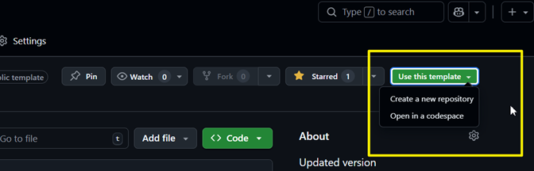

# Agentic AI Case Study Development Starter Kit

A starter kit for creating Harvard Business School (HBS)-style MBA case studies from digital sources, guided by AI.

[](TEMPLATE_VERSION)
[](LICENSE)

> **REVISED — March 2026**: Claude Cowork is now the **recommended path** for this assignment — no terminal, no extensions, no Git knowledge required. See [QUICKSTART-CLAUDE-COWORK.md](QUICKSTART-CLAUDE-COWORK.md) to get started. Students who already use Claude Code or VS Code + Copilot can continue with those paths using the alternative quickstarts below.

---

## What This Is

This repository is a **GitHub template** that gives you everything you need to develop a professional business school case study. You gather source materials (interviews, articles, financial reports), and AI guides you through the entire process — from assessing your sources to writing and verifying your case study package.

### What You Will Produce

| Document                 | Purpose                                                | Length                |
| ------------------------ | ------------------------------------------------------ | --------------------- |
| **Main Case**            | Protagonist-centered narrative with strategic tension  | 1,500–3,000 words     |
| **Additional Sources**   | Raw materials, bibliography, timeline, exhibits        | 3,000–5,000 words     |
| **Technical Supplement** | Industry context, frameworks, glossary                 | 500–1,500 words       |
| **ai-usage-log.md**      | Running log of AI tool usage, prompts, and corrections | Maintained throughout |

> **Note**: The full starter kit supports a fourth document (Teaching Note). This assignment does not require it — focus on the three documents above.

---

## Recommended Path: Claude Cowork

**Claude Cowork is the recommended tool for this assignment.** It gives Claude direct access to your case study folder on your computer. You interact entirely through a chat interface — Claude reads your sources, guides your writing, tracks verification issues, and maintains your ai-usage-log automatically.

**See [QUICKSTART-CLAUDE-COWORK.md](QUICKSTART-CLAUDE-COWORK.md) for full setup and workflow instructions.**

What you need for the Cowork path:

- Claude Pro subscription ($20/month) + Claude desktop app
- GitHub account (free) + GitHub Desktop (free) — required for submission
- Perplexity — for research queries and source discovery (separate tool, used alongside Claude)

---

## Alternative Paths

Students who already have Claude Code or VS Code + GitHub Copilot configured can use those tools instead. All three paths produce the same outputs and work with the same repository structure.

| Feature                | **Claude Cowork** ⭐                                        | Claude Code                                            | VS Code + Copilot                              | Other Chat Tools                       |
| ---------------------- | ---------------------------------------------------------- | ------------------------------------------------------ | ---------------------------------------------- | -------------------------------------- |
| Reads local files      | Yes                                                        | Yes                                                    | Yes (Agent Mode)                               | No                                     |
| Writes/edits files     | Yes                                                        | Yes                                                    | Yes (Agent Mode)                               | No                                     |
| Runs terminal commands | No                                                         | Yes                                                    | Yes                                            | No                                     |
| `/slash-commands`      | No (plain English)                                         | Yes (16 skills)                                        | No (natural language)                          | No                                     |
| Git workflow           | GitHub Desktop                                             | Built-in                                               | Built-in                                       | Manual                                 |
| Setup complexity       | Low                                                        | Medium                                                 | Medium                                         | Minimal                                |
| Best for               | Most students                                              | Claude Code users                                      | GitHub Education users                         | Last resort                            |
| Setup guide            | [QUICKSTART-CLAUDE-COWORK.md](QUICKSTART-CLAUDE-COWORK.md) | [QUICKSTART-CLAUDE-CODE.md](QUICKSTART-CLAUDE-CODE.md) | [QUICKSTART-COPILOT.md](QUICKSTART-COPILOT.md) | [STARTER_PROMPT.md](STARTER_PROMPT.md) |

---

## Getting Started

### Step 1: Create Your Repository

Click the green **"Use this template"** button above, then **"Create a new repository"**. Name it something like `acme-dt-case-study`. Set it to **Private** for now — you will make it public before submitting.



### Step 2: Get the Files onto Your Computer

**Cowork and Chat tool users** — use GitHub Desktop:

1. Install [GitHub Desktop](https://desktop.github.com/) and sign in with your GitHub account.
2. Go to **File → Clone repository**, find your new repo, and click Clone.
3. Choose a local folder that is **not** inside OneDrive or iCloud.

**Claude Code and VS Code users** — clone via terminal:

```bash
cd ~/Desktop
git clone https://github.com/YOUR-USERNAME/YOUR-REPO-NAME.git
cd YOUR-REPO-NAME
```

<details>
<summary><strong>Alternative: Download ZIP (no GitHub Desktop or git required)</strong></summary>

1. Go to your repository on GitHub.
2. Click the green **"Code"** button → **"Download ZIP"**.
3. Unzip to a local folder not synced to OneDrive or iCloud.

Note: Without Git, you will not have version history and cannot push to GitHub for submission. You will need to set up GitHub Desktop later to submit.

</details>

### Step 3: Choose Your AI Tool and Follow Your Quickstart

**→ Cowork users**: See [QUICKSTART-CLAUDE-COWORK.md](QUICKSTART-CLAUDE-COWORK.md) for the complete step-by-step guide. Start there and follow it through submission.

**→ All other paths**: See the dedicated quickstart for your tool:

- **Claude Code** → [QUICKSTART-CLAUDE-CODE.md](QUICKSTART-CLAUDE-CODE.md)
- **VS Code + GitHub Copilot** → [QUICKSTART-COPILOT.md](QUICKSTART-COPILOT.md)
- **Chat tools (ChatGPT, Claude.ai, Gemini)** → Open [STARTER_PROMPT.md](STARTER_PROMPT.md), copy the prompt inside, and paste it into your chat tool. Note: chat tools cannot read files on your computer directly — this path requires more manual effort and is a last resort.

Your quickstart covers everything from here: configuring your case, gathering sources, writing all three documents, verifying your work, and submitting.

*<mark>**NOTE**: </mark>More guidance on the process you can take to build the case can be found in [WORKFLOW.md](WORKFLOW.MD).*

---

## Workflow Overview

The process is **iterative**, not strictly linear. You will cycle between gathering sources and writing as gaps appear.

```
SETUP → SOURCES → ASSESS → WRITE → [gap found?] → back to SOURCES
                                  → [no gap] → VERIFY → PUBLISH
```

| Phase          | What to Do                    | Cowork                               | Claude Code       |
| -------------- | ----------------------------- | ------------------------------------ | ----------------- |
| 1. Configure   | Set up case details           | *"Please run setup-case"*            | `/setup-case`     |
| 2. Add Sources | Register source materials     | *"Scan sources/ and register files"* | `/add-sources`    |
| 3. Assess      | Evaluate source quality       | *"Assess my source quality"*         | `/assess-sources` |
| 4. Write       | Create documents in order     | *"Help me write the next document"*  | `/write-document` |
| 5. Verify      | Run quality checks            | *"Run all quality checks"*           | `/verify-all`     |
| 6. Publish     | Export PDFs, make repo public | *"Prepare for PDF export"*           | `/export-pdf`     |

Check your progress anytime: `/check-status` (Claude Code) or *"What's the current status of my case study?"* (Cowork).

---

## What's in This Repository

| Path                              | Purpose                                                                                                                                                                 |
| --------------------------------- | ----------------------------------------------------------------------------------------------------------------------------------------------------------------------- |
| `QUICKSTART-CLAUDE-COWORK.md`     | **Recommended**: Full setup and workflow guide for Cowork users                                                                                                         |
| `QUICKSTART-CLAUDE-CODE.md`       | Alternative: Full setup and workflow guide for Claude Code users                                                                                                        |
| `QUICKSTART-COPILOT.md`           | Alternative: Full setup and workflow guide for VS Code + Copilot users                                                                                                  |
| `STARTER_PROMPT.md`               | Prompt for chat tools (ChatGPT, Claude.ai, Gemini) only                                                                                                                 |
| `WORKFLOW.md`                     | Detailed phase-by-phase workflow reference                                                                                                                              |
| `case-config.yaml`                | Central configuration (auto-written by setup)                                                                                                                           |
| `verification-debt.yaml`          | Tracks unverified AI-generated claims                                                                                                                                   |
| `sources/`                        | Your research materials                                                                                                                                                 |
| `sources/Source_Registry.md`      | Source catalog with quality tiers                                                                                                                                       |
| `case-study/`                     | Where your three case documents will live                                                                                                                               |
| `exports/`                        | PDF exports for submission                                                                                                                                              |
| `ai-usage-log.md`                 | Running log of AI usage (required deliverable — contributes directly to the AI Tool Usage & Process and Verification rubric dimensions described in the Assignment PDF) |
| `templates/`                      | Detailed prompts, QA workflows, source guides                                                                                                                           |
| `.claude/skills/`                 | Claude Code skill definitions (also read by Cowork)                                                                                                                     |
| `.github/copilot-instructions.md` | VS Code Copilot custom instructions                                                                                                                                     |
| `PROJECT_CONTEXT.md`              | Session continuity context                                                                                                                                              |

---

## Skills Reference

**Cowork users**: Ask for each action in plain English — Claude reads the skill files directly. Examples in the table below.

**Claude Code users**: Use `/slash-commands` as listed.

**VS Code + Copilot users**: Ask in natural language in Agent Mode.

| Command                | Cowork plain English                     | Purpose                     |
| ---------------------- | ---------------------------------------- | --------------------------- |
| `/setup-case`          | *"Please run setup-case"*                | Configure project           |
| `/add-sources`         | *"Scan sources/ and register new files"* | Register source materials   |
| `/assess-sources`      | *"Assess my source quality"*             | Evaluate with go/no-go gate |
| `/write-document`      | *"Help me write the next document"*      | Guided document writing     |
| `/check-status`        | *"What's the current status?"*           | Project dashboard           |
| `/verify-all`          | *"Run all quality checks"*               | Full verification suite     |
| `/validate-financials` | *"Check all financial figures"*          | Arithmetic accuracy         |
| `/assess-bias`         | *"Assess my source balance"*             | Perspective balance         |
| `/add-disclaimers`     | *"Add AI methodology disclaimers"*       | Pre-export disclaimers      |
| `/export-pdf`          | *"Prepare for PDF export"*               | Format for distribution     |
| `/git-update`          | GitHub Desktop: commit + push            | Save and push to GitHub     |

---

## Submitting Your Work

Before submitting, make your GitHub repository **public**:

1. Go to your repo on [github.com](https://github.com/).
2. Click **Settings → scroll to Danger Zone → Change visibility → Make public**.

Then follow the submission instructions on the Canvas assignment page for the complete list of deliverables, file naming requirements, and upload steps.

---

## Troubleshooting

| Problem                             | Solution                                                                                                                 |
| ----------------------------------- | ------------------------------------------------------------------------------------------------------------------------ |
| `git: command not found`            | Install Git from [git-scm.com/downloads](https://git-scm.com/downloads), then restart your terminal                      |
| `git clone` fails                   | Make sure you're using the HTTPS URL (starts with `https://`), not SSH                                                   |
| `uv: command not found`             | Install uv from [docs.astral.sh/uv](https://docs.astral.sh/uv/getting-started/installation/), then restart your terminal |
| Copilot not in Agent Mode           | Click the mode selector in the Copilot chat panel and select "Agent"                                                     |
| Claude Code `/setup-case` not found | Make sure you opened the **cloned project folder** in VS Code or navigated to it in the CLI                              |
| Cowork can't access files           | Make sure the working folder is **not** inside OneDrive or iCloud. Move it to a local path and re-select it in Cowork    |
| Cowork lost session context         | Say: *"Please read ai-usage-log.md and case-config.yaml to catch up on my project"*                                      |
| GitHub Desktop shows no changes     | Click **Repository → Refresh** in GitHub Desktop                                                                         |
| Can't push to GitHub                | Make sure you're signed in to GitHub Desktop with the account that owns the repo                                         |
| AI generated unverifiable content   | Flag it, find a source or remove the claim, and document the correction in ai-usage-log.md                               |

Still stuck? Ask your instructor or TA for help.

---

## Acknowledgments

This methodology was developed through the creation of MBA case studies for ITEC-617 at American University's Kogod School of Business, Spring 2026.

---

*Template Version: 3.1.2*
